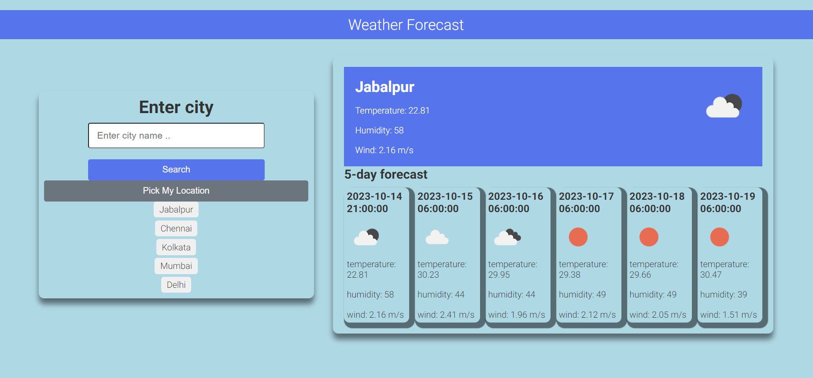

<a name="readme-top"></a>

<div align="center">
  
  <br/>

  <h3><b>Weather Forecast App</b></h3>

</div>

# 📗 Table of Contents

- [📖 About the Project](#about-project)
  - [🛠 Built With](#built-with)
    - [Tech Stack](#tech-stack)
    - [Key Features](#key-features)
  - [🚀 Live Demo](#live-demo)
- [💻 Getting Started](#getting-started)
  - [Setup](#setup)
  - [Prerequisites](#prerequisites)
  - [Install](#install)
  - [Usage](#usage)
  - [Run tests](#run-tests)
  - [Deployment](#triangular_flag_on_post-deployment)
- [👥 Authors](#authors)
- [🔭 Future Features](#future-features)
- [🤝 Contributing](#contributing)
- [⭐️ Show your support](#support)
- [🙏 Acknowledgements](#acknowledgements)
- [📝 License](#license)

# 📖 Recipe-App <a name="about-project"></a>

**Weather Forecast** is SPA built using JavaScript HTML and CSS . Is uses OpenWeather API to fetch data. It tell you the current weather and also forecasts of next  5 days. You can also pick your current location by using system's gps
## 🛠 Built With <a name="built-with"></a>
- JavaScript
- OpenWeather API ,
- Geolocation API
- HTML/CSS

### Key Features <a name="key-features"></a>


- **Displays current weather conditions**
- **Saves list of recent seraches**
- **Pick current location**

<p align="right">(<a href="#readme-top">back to top</a>)</p>

## 🚀 Live Demo <a name="live-demo"></a>

- [Live Demo Link](https://karan-weatherforecast.netlify.app/) 

<p align="right">(<a href="#readme-top">back to top</a>)</p>

## 💻 Getting Started <a name="getting-started"></a>

To get a local copy up and running, follow these steps.

### Prerequisites

In order to run this project you need:

- Node.js & npm
- A web browser


### Setup

Navigate to your desired folder and enter these commands:


```sh
  git clone https://github.com/karanJ2212/weatherForcast-TechAIntern.git
  cd weatherForecast-techAIntern
```

### Usage

To run the project, execute the following command:

use live server or run index file
```

<p align="right">(<a href="#readme-top">back to top</a>)</p>

## 👥 Author <a name="authors"></a>

👤 **Karan Jain**
- GitHub: [@karanj2212](https://github.com/karanJ2212)
- LinkedIn: [@karanjain2212](https:/www.linkedin.com/in/karanjain2212/)


<p align="right">(<a href="#readme-top">back to top</a>)</p>

## 🔭 Future Features <a name="future-features"></a>

- [ ] **UI Improvement**
- [ ] **Mobile version**

<p align="right">(<a href="#readme-top">back to top</a>)</p>

## 🤝 Contributing <a name="contributing"></a>

Contributions, issues, and feature requests are welcome!

Feel free to check the [issues page](https://github.com/karanJ2212/toDoList-techAIntern.git/issues).

<p align="right">(<a href="#readme-top">back to top</a>)</p>

## ⭐️ Show your support <a name="support"></a>

If you like this project, please give it a star ⭐

<p align="right">(<a href="#readme-top">back to top</a>)</p>

## 🙏 Acknowledgments <a name="acknowledgements"></a>
Special thanks to all the assistance received!

<p align="right">(<a href="#readme-top">back to top</a>)</p>

## 📝 License <a name="license"></a>

This project is [MIT](./LICENSE) licensed.

<p align="right">(<a href="#readme-top">back to top</a>)</p>
